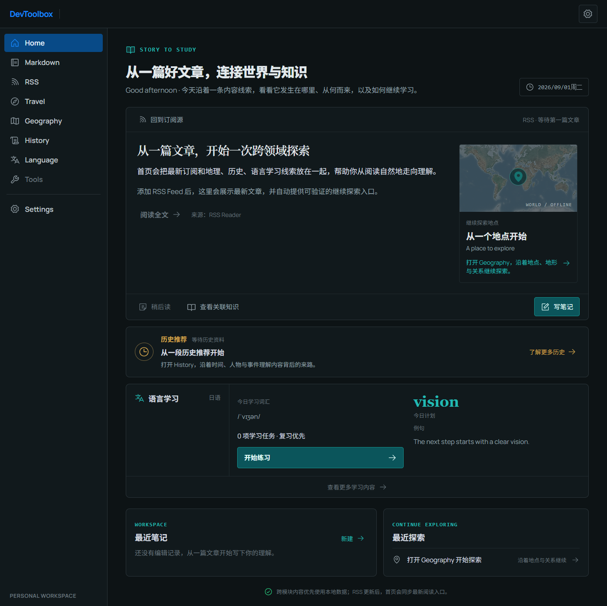
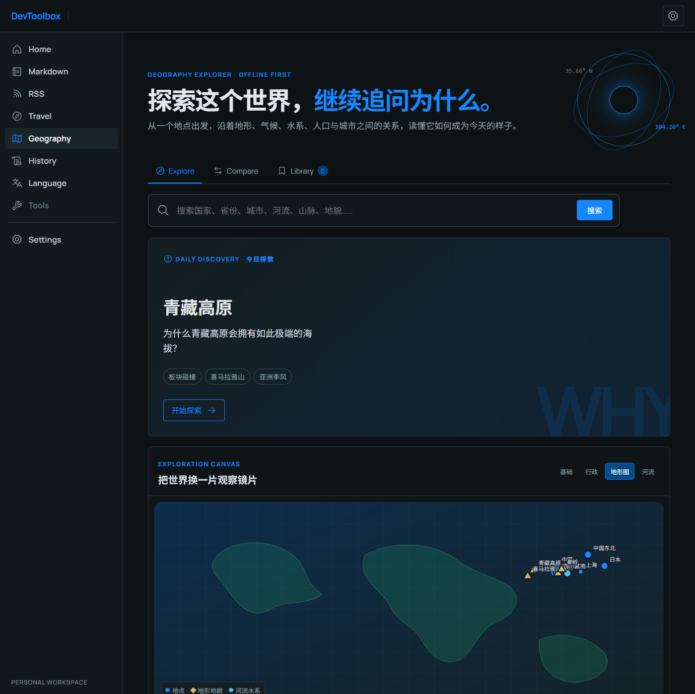

# DevToolbox

一个面向个人的跨平台知识工作台：从 RSS 文章出发，继续探索地点、历史与语言，把“读过”变成“理解过”。

DevToolbox 基于 Rust、Tauri 2 和 React 19 构建，优先使用本地数据与本地存储，适合长期积累笔记、订阅和学习记录。



> 上图为本地前端预览中的 Home 页面，由 Playwright CLI 截取。

## 为什么是 DevToolbox

它不是把多个工具简单堆在一起，而是把一次阅读串成一条可继续的路径：

```text
RSS 文章
  → Home：看到文章、地点、历史和今日学习线索
  → Geography / History：沿着事实和关系继续探索
  → Language：从文章上下文中积累词汇并复习
  → Markdown：写下自己的理解，沉淀为可检索的笔记
```

## 功能概览

| 模块 | 用途 | 当前能力 |
| --- | --- | --- |
| **Home** | 内容入口 | 聚合最新文章、地理推荐、历史推荐、语言学习和最近笔记 |
| **Markdown** | 写作与任务 | 工作区文件树、CodeMirror 编辑器、任务大纲、多状态 Checkbox、专注模式 |
| **RSS** | 订阅阅读 | 添加/删除 Feed、未读计数、后台刷新、SQLite 持久化、全文抓取 |
| **Travel** | 旅行研究 | 规划搜索任务、抓取网页、提取事实、排序来源、生成结构化攻略并缓存 |
| **Geography** | 地理探索 | 离线实体、关系画布、Daily Discovery、搜索、比较、收藏和来源追溯 |
| **History** | 中国历史 | 滚轮式时间轴、人物/事件/地点检索、详情卡片、关系与收藏 |
| **Language** | 多语言学习 | English / Japanese / Mandarin / Cantonese 的词典、例句、收藏、听力、口语和间隔复习 |



Geography 默认使用本地种子数据和离线示意图；配置高德 JS API 后可切换到动态地图。Travel 的搜索、LLM、天气和 POI 数据源也都是可选配置，未配置时仍可使用基础流程。

## 快速开始

### 环境要求

- Rust 1.95+（版本由 `rust-toolchain.toml` 固定）
- Node.js 20+
- npm
- GNU Make（可选；Windows 可用 `scoop install make` 或 `choco install make`）

### 启动开发环境

```bash
git clone git@github.com:wuhanwoaini521/self-tools.git
cd self-tools

# 首次安装前端依赖
make install

# 启动 Tauri 桌面应用
make dev
```

如果只想快速查看前端界面，可运行：

```bash
make dev-web
```

浏览器预览适合检查 UI 和交互外壳；需要访问本地文件、SQLite、离线数据和 Tauri 命令的完整功能时，请使用 `make dev` 启动桌面应用。

### 常用命令

```bash
make build      # 类型检查并构建前端
make test       # 运行 Rust workspace 测试
make package    # 构建 Tauri 安装包
```

不使用 Make 时，对应的前端命令是：

```bash
npm --prefix apps/desktop/ui install
npm --prefix apps/desktop/ui run dev
npm --prefix apps/desktop/ui run build
npm --prefix apps/desktop/ui exec -- tauri dev
npm --prefix apps/desktop/ui exec -- tauri build
```

## 第一次使用

1. 启动桌面应用，打开 **Settings → Language Data**。
2. 点击 **安装 Starter Pack**，即可安装内置的真实数据子集并离线体验语言学习。
3. 在 **Markdown** 中选择一个工作区，或从 Home 的 **写笔记** 开始记录。
4. 在 **RSS** 中添加一个 Feed；刷新后，Home 会出现最新文章入口。
5. 在 **Travel** 和 **Geography** 的设置中按需填写 API Key。所有外部服务均为可选项。

语言数据的来源、版本、许可和完整数据导入方式见 [`docs/language/DATA_SOURCES.md`](docs/language/DATA_SOURCES.md)。

## Markdown 工作流

编辑器保持普通 Markdown 兼容，同时支持三态任务：

| 状态 | 写法 | 含义 |
| --- | --- | --- |
| Pending | `- [ ] 整理资料` | 尚未开始 |
| In Progress | `- [~] 整理资料` | 正在处理 |
| Done | `- [x] 整理资料` | 已完成 |

点击任务标记或使用快捷键即可切换状态。解析规则由 [`tests/fixtures/task_rules.json`](tests/fixtures/task_rules.json) 固化，核心状态注册表位于 [`crates/core/src/task_state.rs`](crates/core/src/task_state.rs)。

### 快捷键

| 操作 | Windows / Linux | macOS |
| --- | --- | --- |
| 打开命令面板 | `Ctrl+F` | `Cmd+F` |
| 切换 Focus Mode | `F11` | `F11` |
| 切换侧栏 | `Ctrl+B` | `Cmd+B` |
| 切换任务大纲 | `Ctrl+\\` | `Cmd+\\` |
| 切换当前任务状态 | `Ctrl+Enter` | `Cmd+Enter` |

## 截图与界面

Markdown 的 Focus Mode、Zen Mode 和命令面板：

<table>
  <tr>
    <td></td>
    <td></td>
    <td></td>
  </tr>
</table>

## 项目结构

```text
.
├── Cargo.toml                 # Rust workspace
├── rust-toolchain.toml        # 固定 Rust 工具链
├── apps/desktop/
│   ├── src/                   # Tauri 命令层与应用状态
│   └── ui/src/                # React 外壳与 features
├── crates/
│   ├── core/                  # 领域模型与纯业务规则
│   ├── application/           # 用例编排与服务
│   └── infrastructure/       # 文件、SQLite、网络和数据导入
├── tests/fixtures/            # 共享测试样例与 Starter Pack 数据
└── docs/                      # 架构、迁移、数据源和截图
```

模块边界遵循：`UI ≠ 领域规则 ≠ 文件/数据库读写 ≠ 网络抓取`。前端按 `ui/src/features/<module>` 划分，公共主题、设置和工具放在共享层。

## 数据与可追溯性

- 桌面应用的运行时数据统一保存在项目根目录的 `config/`：包括 `settings.json`、RSS 的 `dashboard.db`、Travel 的 `travel.db`、History 的 `history.db`、Geography 的 `geography.db` 和 Language 的 `language.db`；该目录已加入 `.gitignore`，不会提交到 Git。
- 如果旧版本曾把数据写入系统 AppData，应用首次启动时会把缺失的文件复制到项目 `config/`，不会覆盖已经存在的项目数据，也不会删除旧文件。
- Language 的词典和例句来自可追溯的开放数据集：Open English WordNet、CMUdict、JMdict、KANJIDIC2、CC-CEDICT、words.hk、CC-Canto 和 Tatoeba。
- Geography 当前使用小型内置种子数据；正式边界和大规模几何数据会在许可核验后再导入。
- Travel 生成攻略时保留来源列表；没有 LLM 或 API Key 时降级为来源与基础信息模式，不凭空补全内容。
- 原始下载数据放在 `data/raw/`，生成数据放在 `data/generated/`，两者均不会进入 Git。

## 质量检查

提交前可在仓库根目录运行：

```bash
cargo fmt --check
cargo check --workspace
cargo clippy --workspace --all-targets --all-features -- -D warnings
cargo test --workspace
npm --prefix apps/desktop/ui run build
```

## 迁移说明

项目早期版本基于 PySide6，当前实现已迁移到 Rust + Tauri。迁移决策、模块盘点和技术债务记录保留在 [`docs/migration/`](docs/migration/) 中，作为历史档案。
