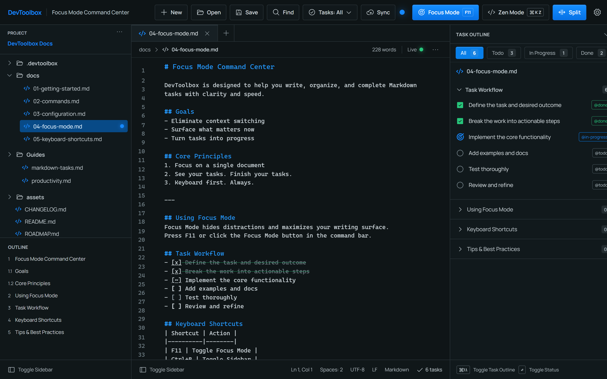
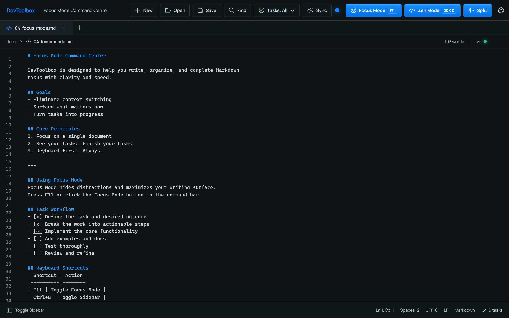
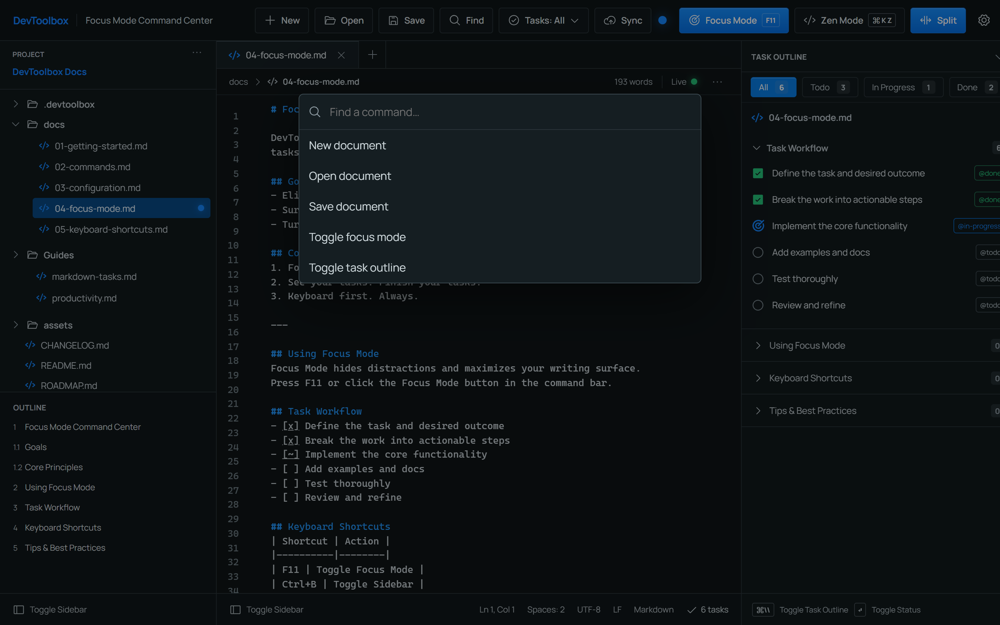

# DevToolbox

跨平台（Windows / Linux / macOS）**个人 Dashboard / 效率中心**。

目标是一个可以持续容纳多个个人工具的工作台，当前已内置：

- **Home** — 个人信息总览（最近笔记、最新订阅、快捷入口）
- **Markdown** — 笔记与任务管理，核心特色是**多状态 Checkbox**（Pending / In Progress / Done）与键盘优先的专注写作流
- **RSS** — 订阅阅读器：添加 / 删除订阅、未读计数、定时后台刷新、SQLite 持久化
- **Travel** — 旅行研究 Agent：输入城市 → 自动规划搜索任务 → 搜索国内互联网（Bing 中国 / 百度 / 本地 SearXNG，均可配置）→ 抓取网页 → 事实提取 → 来源可信度排序 → 多源验证与冲突检测 → 生成结构化攻略（含 Sources）并本地缓存（24h/7d）。未配置 LLM / API Key 时仍可运行（降级为“来源 + 基础信息”模式，绝不编造）
- **Language** — 多语言学习中心（English / Japanese 完整闭环 + Mandarin / Cantonese 统一架构）：离线优先的词典/搜索/例句/收藏/学习状态/间隔复习/听力/口语，数据全部来自**可追溯的开放数据集**（Open English WordNet + CMUdict、JMdict + KANJIDIC2、CC-CEDICT、words.hk + CC-Canto、Tatoeba），许可与 attribution 在 Settings → Language Data 完整展示；内置 Starter Pack（真实数据子集）首次运行即可安装，完整数据包用 `language-data import …` 导入（见 `docs/language/DATA_SOURCES.md`）

技术栈：Rust + Tauri 2 + React 19 + CodeMirror 6。



## 界面一览

| Focus Mode 工作区 | Zen Mode | 命令面板 |
|---|---|---|
| 项目树、编辑器、任务大纲三栏联动 | 隐藏一切干扰，纯写作面 | `Ctrl+F` 快速执行命令 |

<table>
  <tr>
    <td></td>
    <td></td>
  </tr>
</table>

## 开发环境

前置要求：Rust 1.95+（`rust-toolchain.toml` 自动固定）、Node.js 20+、GNU Make（可选；Windows 可用 `scoop install make` 或 `choco install make`）。

语言数据工具（可选）：`cargo run -p devtoolbox-application --bin language_data -- help`，
可用于从官方文件导入完整数据包（English / Japanese / Mandarin / Cantonese / Sentences）。
内置 Starter Pack 覆盖开箱即用的真实子集；许可/来源见 `docs/language/DATA_SOURCES.md`。

### 快捷命令（推荐，见仓库根目录 `Makefile`）

```bash
make dev        # 启动桌面应用开发调试（Tauri + Vite，首次自动装依赖）
make dev-web    # 仅前端开发（浏览器预览，无需 Rust 编译）
make build      # 构建前端产物（tsc --noEmit + vite build）
make package    # 发布构建（生成安装包）
make install    # 安装前端依赖
make test       # 运行 Rust 工作区测试
```

### 等价的原生命令

```bash
# 前端依赖（首次）
npm --prefix apps/desktop/ui install

# 桌面应用开发调试
npm --prefix apps/desktop/ui exec -- tauri dev

# 仅前端开发（浏览器预览，无需 Rust 编译）
npm --prefix apps/desktop/ui run dev
```

发布构建：

```bash
npm --prefix apps/desktop/ui exec -- tauri build
```

## 核心体验

```
打开应用 → Home 总览 → 进入 Markdown → 写下 US / JP / CA
→ 转换为任务 → Ctrl+Enter 切换状态（Pending → In Progress → Done → Pending）
→ 保存 → 下次打开状态仍在；RSS 订阅在后台按时刷新，未读数挂在导航上
```

## 多状态 Checkbox 语法

底层保持纯 Markdown 任务列表，其他编辑器打开完全可读：

| 状态 | Markdown | 符号 | 颜色 |
| ------ | ---------- | ------ | ------ |
| Pending | `- [ ] US` | ○ | 灰 |
| In Progress | `- [~] JP` | ◐ | 蓝 |
| Done | `- [x] CA` | ● | 绿 |

- 点击编辑器中的 `[ ]` 标记即可切换状态；
- 编辑器内任务标记按状态着色（`[ ]` 灰 / `[~]` 蓝 / `[x]` 绿），已完成行自动删除线变暗，
  与右侧任务大纲面板视觉统一；
- 状态定义集中在 `crates/core/src/task_state.rs` 的注册表中，
  新增 Blocked / Failed 等状态只需 `register()` 一条；
- 解析规则由 `tests/fixtures/task_rules.json` 固化，Rust 单元测试直接消费该文件。

## 编辑器美化

装饰逻辑位于 `apps/desktop/ui/src/markdown-decorations.ts`（CodeMirror ViewPlugin）：

- **任务标记状态着色**：`[x]` 绿色 + 删除线，`[~]` 蓝色，`[ ]` 灰色；
- **标题分级配色**：H1–H6 由亮到暗的蓝色阶，`#` 记号弱化，H1/H2 字号微调；
- **围栏代码块**：整块背景色 + 左侧色条，围栏记号弱化；
- **引用块**：左侧蓝色条 + 微背景 + 斜体；
- **列表自动延续**：在列表项末尾回车，自动补全 `-`/序号前缀。

## 快捷键

| 动作 | Windows / Linux | macOS |
| ------ | ----------------- | ------- |
| 打开命令面板 | Ctrl+F | Cmd+F |
| 切换 Focus Mode | F11 | F11 |
| 切换侧栏 | Ctrl+B | Cmd+B |
| 切换任务大纲 | Ctrl+\ | Cmd+\ |
| 切换任务状态（当前行） | Ctrl+Enter | Cmd+Enter |

## 工作区

选择一个文件夹后，侧栏以**目录树**形式列出其中所有 Markdown 文件
（自动跳过 `.git`、`node_modules` 等噪音目录），点击即打开；应用会记住上次的工作区。

## 项目结构

仓库根即 Rust workspace，按领域分层：

```
├── Cargo.toml               # workspace 定义（lint、共享依赖）
├── rust-toolchain.toml      # 固定 Rust 版本
├── crates/
│   ├── core/                # 纯领域规则：任务行解析、状态注册表、Travel 领域（无 UI / 无 I/O）
│   ├── application/         # 用例编排：文档工作流 + RSS 工作流 + Travel 研究服务（抓取/落库两段式）
│   └── infrastructure/      # 文件 IO、设置存储、SQLite(RSS/Travel 缓存)、工作区扫描、feed-rs、
│                            #   Travel 的搜索 Provider / 网页抓取 / LLM(OpenAI-Compatible) / 数据源预留
├── apps/
│   └── desktop/             # Tauri 桌面适配器（命令层 + AppState）
│       ├── src/             # Tauri 命令 / 事件边界（文档 / RSS / Travel / History / Language 各自独立）
│       └── ui/              # React 19 前端：外壳(导航) + features(home/markdown/rss/travel/history/language)
├── tests/fixtures/          # 跨实现共享的 Markdown 行为样例
├── data/                   # 原始数据集（gitignored）+ 生成数据
├── tests/fixtures/language/ # Language 真实数据子集（Starter Pack，attribution 完整）
└── docs/
    ├── language/            # Language 架构分析 + 数据源/许可登记（DATA_SOURCES.md）
    ├── migration/           # PySide6 → Rust 迁移历史档案
    ├── travel/              # Travel 模块设计档案
    └── screenshots/
```

分层原则：`UI ≠ 领域解析 ≠ 文件/数据库读写 ≠ 网络抓取`；
前端按 feature 划分（`ui/src/features/<模块>`），公共能力（主题、设置、工具函数）在外壳与共享层。

## 质量门禁

在仓库根运行（CI 于 Windows / macOS / Linux 三平台执行同一组命令）：

```bash
cargo fmt --check
cargo check --workspace
cargo clippy --workspace --all-targets --all-features -- -D warnings
cargo test --workspace
```

覆盖：解析器单元测试（含共享 fixture）、状态注册表、文档存取与工作区扫描。

## 迁移历史

本项目由 PySide6 (Python) 迁移至 Rust，原 Python 版已移除。
迁移过程的设计决策与阶段记录保留在 `docs/migration/`，仅作历史档案。
