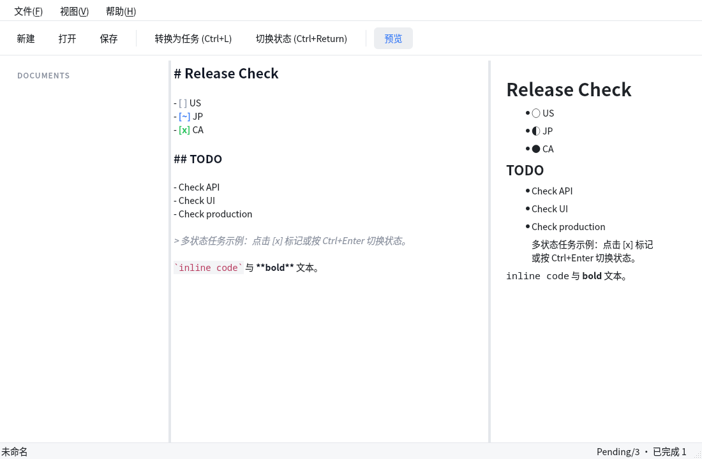

# OxNote

跨平台（Windows / Linux / macOS）Markdown 笔记工具，核心特色是
**多状态 Checkbox**（Pending / Ing / Done，可扩展）。

技术栈：Python + PySide6。



## 开发环境（uv）

项目使用 [uv](https://docs.astral.sh/uv/) 管理依赖与虚拟环境：

```bash
uv sync              # 创建 .venv 并安装锁定版本的依赖
uv run run.py        # 运行应用（或 uv run python -m src.main）
uv add <package>     # 添加运行时依赖
uv add --dev pytest  # 添加开发依赖
```

## 核心体验

```
打开应用 → 写 Markdown → 写下 US / JP / CA
→ 选中 → Ctrl+L 转换为任务
→ Ctrl+Enter 切换状态（Pending → Ing → Done → Pending）
→ 保存 → 下次打开状态仍在
```

## 多状态 Checkbox 语法

底层保持纯 Markdown 任务列表，其他编辑器打开完全可读：

| 状态 | Markdown | 符号 | 颜色 |
|------|----------|------|------|
| Pending | `- [ ] US` | ○ | 灰 |
| Ing | `- [~] JP` | ◐ | 蓝 |
| Done | `- [x] CA` | ● | 绿 |

* 点击编辑器中的 `[ ]` 标记即可切换状态；
* 状态定义集中在 `src/document/task_state.py` 的注册表中，
  新增 Blocked / Failed 等状态只需 `register()` 一条。

## 快捷键

| 动作 | Windows / Linux | macOS |
|------|-----------------|-------|
| 新建 | Ctrl+N | Cmd+N |
| 打开 | Ctrl+O | Cmd+O |
| 打开文件夹（工作区） | Ctrl+Shift+O | Cmd+Shift+O |
| 保存 | Ctrl+S | Cmd+S |
| 另存为 | Ctrl+Shift+S | Cmd+Shift+S |
| 选中行转换为任务 | Ctrl+L | Cmd+L |
| 切换到下一状态 | Ctrl+Enter | Cmd+Enter |
| 切换到上一状态 | Ctrl+Shift+Enter | Cmd+Shift+Enter |
| 预览开关 | 菜单 视图 → 预览 | 同左 |

编辑器快捷键集中定义在 `src/shortcuts/shortcut_manager.py`，
为未来用户自定义绑定预留了 `action_id`。

## 工作区

通过「文件 → 打开文件夹」选择一个文件夹后，侧栏会以**目录树**形式列出其中所有
Markdown 文件（自动跳过 `.git`、`node_modules` 等噪音目录），点击即打开；
应用会记住上次的工作区。

## 项目结构

```
src/
├── main.py                  # 入口：QApplication + 主题 + 主窗口
├── ui/
│   ├── main_window.py       # 主窗口（只做装配与协调）
│   ├── sidebar.py           # 最近文档侧栏
│   ├── theme.py             # 配色与样式表
│   └── editor/
│       ├── markdown_editor.py   # 编辑器：转换/切换/点击切换/列表延续
│       ├── highlighter.py       # Markdown 语法高亮
│       └── preview.py           # 简易预览面板
├── document/
│   ├── document.py          # 文档模型（路径元数据）
│   ├── parser.py            # 任务行解析 / 生成 / 切换
│   └── task_state.py        # 任务状态注册表（可扩展）
├── services/
│   └── document_service.py  # 文件 IO + 最近文档
├── shortcuts/
│   └── shortcut_manager.py  # 快捷键集中管理
└── config/
    └── settings.py          # QSettings 配置（跨平台路径）
```

分层原则：`UI ≠ Markdown 解析 ≠ 文件读写 ≠ 任务状态逻辑`。

## 测试

```bash
uv run pytest -v            # 推荐
# 或
uv run python -m unittest discover -s tests -v
```

覆盖：解析器单元测试、编辑器转换/切换/Undo/边界场景、
保存-重开状态恢复往返、未保存检测。
