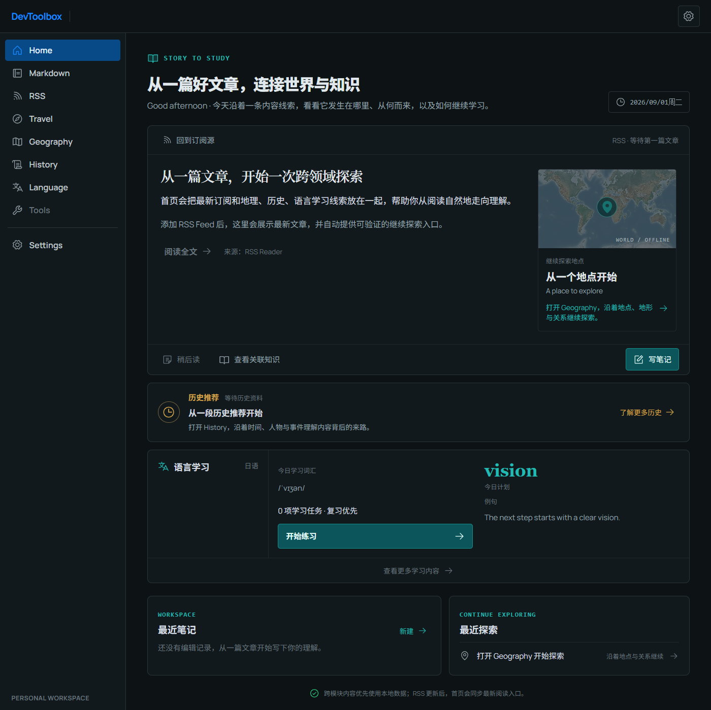
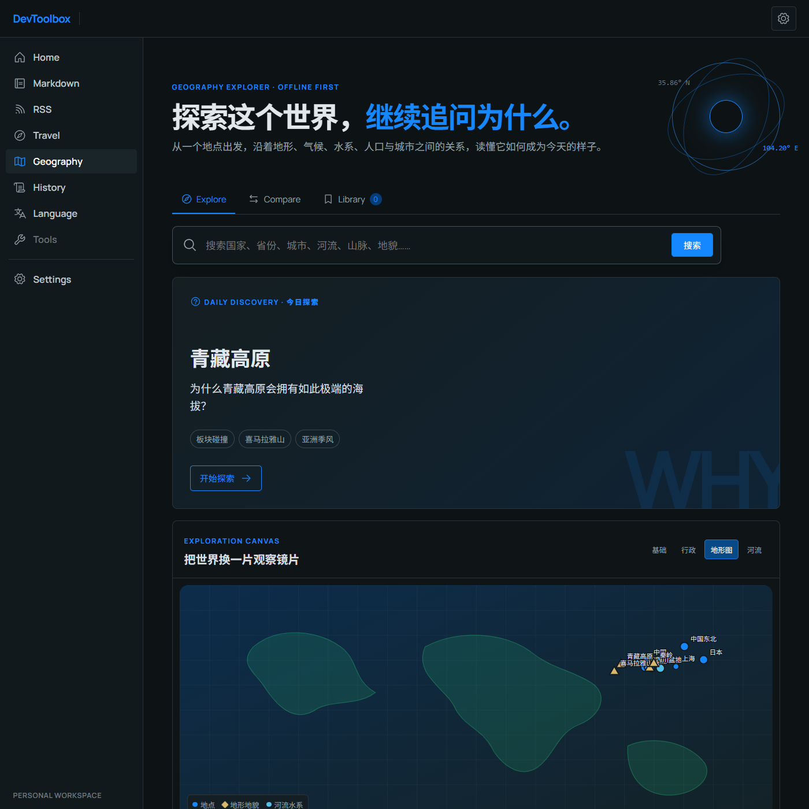
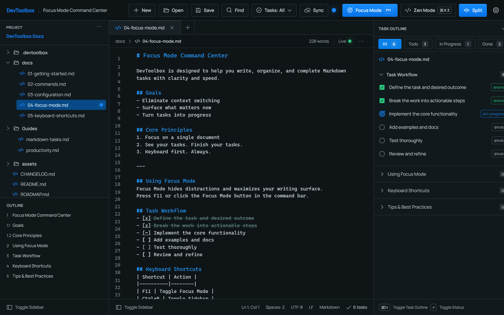
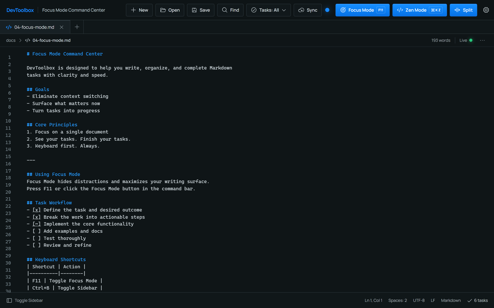
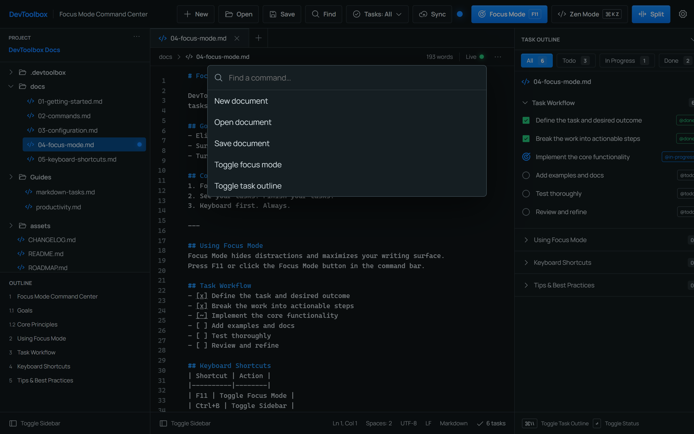

# DevToolbox

DevToolbox 是一款以本地数据为基础的个人知识工作台。它把 AI 对话、文件与文档、订阅阅读、历史与地理探索、语言学习和学习白板放在同一个桌面与移动端界面中，帮助个人资料持续积累并可再次检索。



## 功能

| 模块 | 能做什么 |
| --- | --- |
| **Home 与 AI** | 从首页发起提问；AI 可结合当前页面上下文调用已注册的知识工具。对话可持久化。 |
| **Knowledge** | 管理个人记忆、文档和授权目录内的文件，并检索相关内容。记忆写入需要用户确认。 |
| **News 与 RSS** | 浏览新闻和订阅源，查看条目、搜索内容并刷新订阅。 |
| **History** | 浏览中国历史时期、事件、人物与作品；可使用补充资料功能。历史主库由独立数据管线生成，应用只读消费。 |
| **Geography 与 Travel** | 探索地理实体、地形和地图，研究目的地并查看行程预览。地图、搜索、天气、POI 与 AI 能力视配置而定。 |
| **Language** | 学习英语、日语、普通话和粤语，使用词汇库、听说练习与间隔复习。可选数据包和数据来源见[语言数据说明](docs/language/DATA_SOURCES.md)。 |
| **Study Board** | 创建学习白板，绘制、撤销/重做并保存快照。 |
| **Search、Server 与 Settings** | 全局搜索、查看家庭服务器状态与日志、配置应用和服务。涉及系统修改的操作需要确认。 |

桌面应用基于 Tauri 2；前端也包含 PWA 资源和适配手机、平板的界面。AI 模型、语音识别、外部搜索、地图及远程身份服务需要自行配置；不配置时相应功能会受限，其他本地功能仍可使用。远程 MCP 默认关闭。



## 开始使用

### 环境

- Rust stable，最低版本 1.95（见 `rust-toolchain.toml`）
- Node.js 20 或更高版本及 npm
- 桌面构建所需的 Tauri 平台依赖；Windows 使用 MSVC 工具链
- GNU Make（可选，用于简化命令）

### 启动桌面应用

```bash
git clone https://github.com/wuhanwoaini521/self-tools.git
cd self-tools

# 安装前端依赖
npm --prefix apps/desktop/ui install

# 启动 Tauri 桌面应用
npm --prefix apps/desktop/ui exec -- tauri dev
```

安装 GNU Make 后也可以运行：

```bash
make install
make dev
```

仅启动 Vite 前端预览（不启动 Rust/Tauri 后端）：

```bash
npm --prefix apps/desktop/ui run dev
# 或 make dev-web
```

浏览器预览用于查看界面；依赖桌面桥接、本地文件或 SQLite 的功能需要在 Tauri 应用中体验。

### 构建与检查

```bash
# 前端类型检查与生产构建
npm --prefix apps/desktop/ui run build

# 构建桌面安装包
npm --prefix apps/desktop/ui exec -- tauri build

# Rust workspace
cargo check --workspace
cargo test --workspace
```

使用 Make 时，对应命令为 `make build`、`make package` 和 `make test`。

### 自动化回归测试

首次运行先安装桌面端和 UI 依赖：

```bash
npm --prefix apps/desktop ci
npm --prefix apps/desktop/ui ci
```

按测试层运行：

```bash
# Rust workspace 业务测试
cargo test --workspace

# 前端单元测试（快捷键注册表、PWA 等）
npm --prefix apps/desktop/ui test

# Windows 桌面端 E2E：构建带测试驱动的 Tauri 应用并启动真实窗口
npm --prefix apps/desktop run test:e2e

# 五种视口的 UI、可访问名称、溢出和浏览器异常回归
npm --prefix apps/desktop run test:visual

# 依次运行上述全部测试
npm --prefix apps/desktop run test:all
```

桌面 E2E 目前以 Windows 为原生门禁，需要已安装 Rust Windows target、WebView2 和 Edge WebDriver 环境。测试配置把应用数据指向临时目录，使用固定 Markdown fixture 和 Tauri IPC mock，不读取仓库 `config/` 中的个人数据或密钥。测试截图、WDIO 日志及视觉 JSON 报告写入仓库根目录 `output/`（该目录不纳入版本控制）；测试驱动仅由 `e2e` Cargo feature 编入测试构建。

## 数据与配置

- 桌面端本地设置和业务数据库位于仓库的 `config/`，该目录已加入 Git 忽略规则。不要把密钥或个人数据库提交到版本库。
- AI、Jev、地图、搜索、天气、POI 和身份服务均需在设置中按需配置。密钥保存在本地设置中；界面状态只显示是否已配置等必要信息。
- History 数据由 [`history-data-pipeline/`](history-data-pipeline/README.md) 维护。桌面应用读取生成的 `history-data-pipeline/dist/history.duckdb`；该产物缺失时历史功能会报告数据不可用，不会静默切换到旧数据。
- 原始语料和生成数据按各自模块的数据说明管理，不应将本地下载内容或个人资料提交到 Git。

更多部署、备份恢复和排障说明见 [`docs/operations/`](docs/operations/)；模块设计和数据来源见 [`docs/`](docs/) 下对应目录。

## 仓库结构

```text
apps/
  desktop/       Tauri 桌面壳与 React 前端
  mcp/           MCP 传输适配器（STDIO / Streamable HTTP）
  server/        只读 History HTTP 服务试点
crates/
  core/          领域模型与业务规则
  application/   用例、服务与模块编排
  infrastructure/文件、SQLite、网络与数据存储适配
history-data-pipeline/  中国历史数据维护与构建管线
docs/            架构、运维、数据来源、验收记录与截图
tests/           共享测试夹具
```

依赖方向为 `core ← application ← infrastructure`；桌面、MCP 和 HTTP 服务负责接入具体运行环境。MCP 是工具协议适配层，具体能力由应用服务注册。HTTP History 服务当前是只读试点，默认监听 `127.0.0.1:8080`；MCP 默认使用本地 STDIO，HTTP 模式默认绑定 `127.0.0.1:8787`，远程绑定需要显式启用并配置身份提供者。

## 文档与截图

- [运维部署](docs/operations/PRODUCTION_V11.md) · [备份与恢复](docs/operations/BACKUP_RESTORE.md) · [排障](docs/operations/TROUBLESHOOTING.md)
- [安全模型](docs/operations/SECURITY_MODEL.md) · [语言数据来源](docs/language/DATA_SOURCES.md) · [地理数据来源](docs/geography/GEOGRAPHY_DATA_SOURCES.md)
- Markdown 编辑器界面：

  | 专注模式 | Zen 模式 | 命令面板 |
  | --- | --- | --- |
  |  |  |  |
