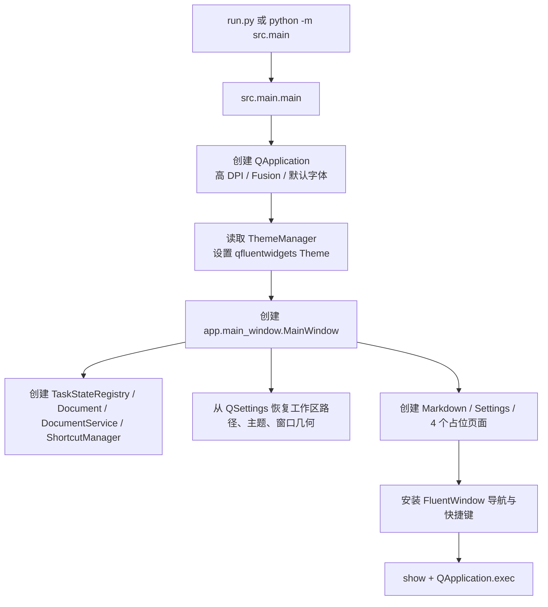
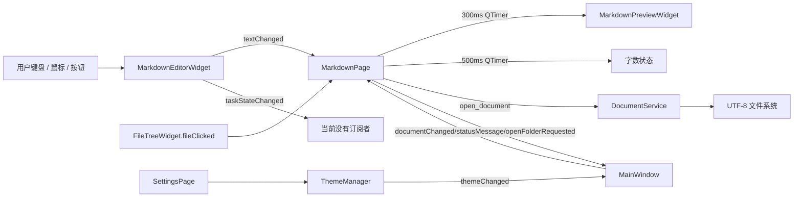

# 当前架构

## 项目概览

当前可执行产品的应用名是 **DevToolbox**（`pyproject.toml`），实际已实现的核心是 Markdown 笔记与三态任务编辑器；README 中的产品名 **OxNote** 与此不一致。用户可打开/新建/保存 UTF-8 文本，选择工作区并浏览 Markdown 文件，编辑 Markdown，在 `Pending → Ing → Done` 之间切换任务状态，查看预览，切换主题和调用命令面板。

`API Test`、`JSON Tool`、`String Tool`、`Converter` 仅显示 “Coming Soon” 占位界面，没有业务实现或外部调用。因此它们不是当前功能对等的范围，而是未来产品需求。

## 技术栈

| 范畴 | 当前实现 |
| --- | --- |
| 运行时 | Python >= 3.10，uv 管理环境与锁文件 |
| GUI | PySide6、qfluentwidgets（`FluentWindow` 导航） |
| Markdown | mistune（表格、删除线）；Qt `QTextBrowser` 预览 |
| 编辑器 | `QPlainTextEdit`、`QSyntaxHighlighter`、轻量自定义代码高亮 |
| 配置 | Qt `QSettings` / `QStandardPaths` |
| 存储 | UTF-8 文本文件、用户配置；没有数据库、网络或远程 API |
| 主题 | `darkdetect` + 进程级 `ThemeManager` |
| 测试 | pytest 可收集 unittest 风格测试；Qt 离屏 GUI 测试 |
| 打包 | 未配置冻结、安装器、自动升级或发布流水线 |

直接依赖仅有 PySide6、pyside6-fluent-widgets、mistune、darkdetect；开发依赖仅 pytest。

## 重要目录

| 路径 | 角色 |
| --- | --- |
| `src/main.py` | 实际启动入口 |
| `src/app/main_window.py` | 现役 Fluent 主窗口，创建并装配页面 |
| `src/modules/markdown/` | 核心编辑页、源码编辑器、预览 |
| `src/document/` | 文档路径模型、任务状态及 Markdown 行解析 |
| `src/services/document_service.py` | 文件读写、文件/目录选择、工作区扫描、最近文件 |
| `src/config/settings.py` | QSettings 封装 |
| `src/ui/` | 命令面板、文件树、主题、语法高亮；另含过时主窗口 |
| `tests/` | 8 个测试文件，覆盖解析、编辑行为、预览、工作区、主题和离屏 UI |
| `docs/screenshot.png` | 唯一现有静态资源 |

## 启动流程



启动不发起网络请求；在工作区路径存在时，会在创建后同步扫描目录并构建文件树。`DocumentService` 的文件读写在 UI 线程同步执行。

## UI 架构

```text
FluentWindow (src/app/main_window.py)
├── MarkdownPage
│   ├── 顶部工具栏：文件树、视图、转换、状态循环、保存、打开
│   ├── FileTreeWidget
│   ├── MarkdownEditorWidget (QPlainTextEdit + MarkdownHighlighter)
│   ├── MarkdownPreviewWidget (QTextBrowser)
│   └── 状态栏：行列、编码、字数
├── ApiTestPage（占位）
├── JsonToolPage（占位）
├── StringToolPage（占位）
├── ConverterPage（占位）
└── SettingsPage
    ├── 主题
    ├── 编辑器字号 / 自动保存设置
    └── 默认 Markdown 视图设置

CommandPalette（模态对话框，由 Ctrl+K 打开）
```

页面切换由 `FluentWindow.addSubInterface` 的内部导航栈完成；命令面板绕过公共接口，直接访问 `MarkdownPage._editor_widget` 和 `FluentWindow._stackedWidget`。`MarkdownPage` 同时承担布局、页面状态、文件用例、预览刷新、字数统计、滚动同步、未保存确认和 UI 错误显示，属于当前最大的 UI/应用层混合点。

## Signal / Slot 与数据流



`Document.pathChanged` 目前没有被现役 `MainWindow` 连接；`MarkdownPage.documentChanged` 只在文本变化时发射。大多数 Qt 信号为同线程同步 UI 事件；唯一跨线程通道是预览线程发出的 `_htmlReady(generation, html)`，由 Qt 排队回主线程应用 HTML。

## 状态与生命周期

| 状态 | 当前所有者 | 写入者 | 读取者 | 生命周期 |
| --- | --- | --- | --- | --- |
| 当前文件路径 | `Document` QObject | MarkdownPage | MarkdownPage、MainWindow | 主窗口 |
| 文本/undo/modified | `QTextDocument` | 编辑器、打开/新建/保存流程 | MarkdownPage | 编辑器 |
| 任务状态定义 | `TaskStateRegistry` | 启动时注册 | 解析、编辑器、高亮、预览 | 主窗口 |
| 工作区根目录 | MainWindow 与 MarkdownPage 各自一份 | 打开目录 | 文件树、扫描 | 主窗口 |
| 视图模式 | MarkdownPage | 工具栏/命令 | MarkdownPage | 页面 |
| 主题模式 | 模块级 `_theme` 单例 + QSettings | Settings/MainWindow | 所有 UI | 进程 + 持久化 |
| 最近文件、窗口几何、偏好 | QSettings | 设置/窗口流程 | 启动和服务 | 跨进程 |

没有网络缓存、账号状态、数据库状态或跨进程状态。

## 并发模型

| 任务 | 启动者 | 运行位置 | 回传/取消 |
| --- | --- | --- | --- |
| Markdown HTML 渲染 | `MarkdownPreviewWidget.render_markdown` | 每次请求创建 daemon `threading.Thread` | `_htmlReady` Qt 信号；无显式取消，仅 generation 丢弃旧结果 |
| 预览防抖 | MarkdownPage | UI 事件循环 `QTimer`，300ms | timeout 直接刷新 |
| 字数防抖 | MarkdownPage | UI 事件循环 `QTimer`，500ms | timeout 全量扫描文本 |
| 文件读写与扫描 | MarkdownPage/FileTree | UI 线程同步 | 同步结果/异常 |

未使用 `QThread`、线程池、asyncio、subprocess 或网络库。风险是大文件读写、目录扫描仍会阻塞 UI；连续编辑时预览会生成不可取消的短命线程。

## 存储与兼容边界

文档使用 `Path.read_text/write_text(encoding="utf-8")`；保存不会自动追加换行，也没有原子写入、BOM/其他编码探测或冲突检测。任务格式是普通 Markdown：`- [ ]`、`- [~]`、`- [x]`；未知标记被保留。工作区递归扫描 `.md`、`.markdown`，跳过 `.git`、虚拟环境、依赖和隐藏目录。配置键包括最近文件、工作区路径、窗口几何、主题、编辑器偏好和默认视图。

## 现有测试基线

源码中共有 107 个 `test_*` 测试：解析/状态注册表、编辑操作与 Undo、鼠标/回车行为、预览异步与过期结果、工作区扫描、主题设置、命令面板、文件树、页面存在性和保存往返。它们是重要的行为规格，但许多测试直接断言私有 Qt 字段，不能逐行迁移；应先提炼为黑盒验收用例与 Rust 单元测试。

## 未采用的旧路径

`src/ui/main_window.py` 是未被入口导入的旧 `QMainWindow` 实现，且仍导入已删除的 `ui.editor.markdown_editor`、`ui.editor.preview` 与 `ui.sidebar`。它不属于运行路径，不能作为迁移依据。README 的目录说明也仍指向这套旧结构。
