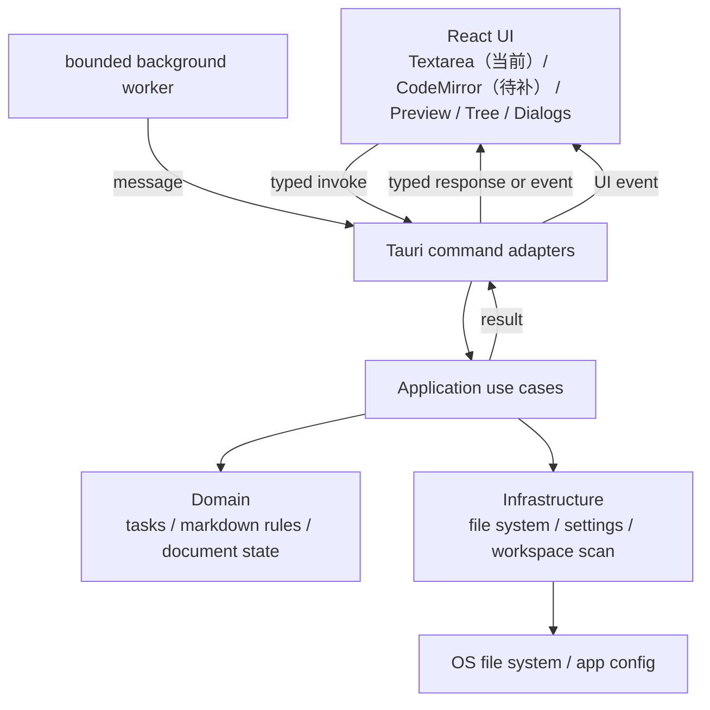

# 目标 Rust 架构

本设计以 Tauri 为推荐实现，不在本阶段创建任何 Rust 文件或 Cargo 项目。它将领域规则与平台/UI 边界分开，但不人为引入 DDD、event bus 或仓储 trait 层。



## 计划目录（确认后才创建）

```text
rust-app/
├── Cargo.toml                 # workspace
├── crates/
│   ├── core/                  # 无 Tauri/IO/UI：task、parser、domain errors
│   ├── application/           # 文档/工作区/设置用例和 DTO
│   └── infrastructure/        # fs、配置、平台路径实现
├── apps/
│   └── desktop/
│       ├── src/               # Tauri command 与应用装配
│       ├── tauri.conf.json
│       └── ui/                # React/TypeScript 前端
│           └── src/
│               ├── features/markdown/
│               ├── features/settings/
│               ├── components/
│               └── app/
└── tests/
    ├── fixtures/              # Python/Rust 共用 Markdown 行为样例
    └── integration/
```

仅在出现可独立发布或复用边界时使用 workspace crate；第一阶段可先使用 `core`、`application`、`desktop` 三个单元，避免几十个微 crate。

## 模块职责

### Domain (`core`)

- `TaskState`、固定三态循环与未知 mark 保留策略。
- `TaskLine`/`TaskLineInfo` 的解析、转换、状态切换、文本重建。
- 无文件、时间、线程、Tauri 或 UI 类型；输入输出是字符串与普通值。

### Application

- `DocumentState { path, dirty, text, workspace_root, view_mode }`。
- `new/open/save/save_as/set_workspace` 等用例，处理未保存确认所需的结果（例如 `NeedsDiscardConfirmation`），而不是弹框。
- `WorkspaceFile` DTO、命令列表 DTO、设置读写和错误归类。

### Infrastructure

- `Utf8DocumentStore`：UTF-8 读写、原子写入临时文件后替换、明确的路径/权限错误。
- `WorkspaceScanner`：复用当前 `.md/.markdown` 和跳过目录规则。
- `SettingsStore`：版本化、原子持久化的配置；迁移期可只读导入旧 QSettings 值，写入新格式。
- 对话框属于 desktop adapter，不在 infrastructure service 内。

### Desktop/UI

- React 维护渲染所需的本地 UI state（光标、面板开闭、编辑器实例）；Rust 不保存 DOM/UI 引用。
- 每个用户动作发送稳定 action id 和输入 DTO；Tauri command 只做验证、调用 use case、返回 DTO。
- 当前 `textarea` 的编辑缓冲留在前端；保存/打开时与 `DocumentState` 同步。引入 CodeMirror 后仍保持此边界。文档规则的权威实现只能是 Rust core。

## 状态、事件与并发

```text
UI event
  → frontend action
  → Tauri command
  → application use case
  → core / infrastructure
  → Result<DTO, AppError>
  → UI state update / render
```

`AppState` 只保存进程级依赖（配置路径、服务实例、受控任务取消句柄），不保存每个页面的编辑文本或 DOM 状态。单窗口版本中大多数命令在 UI 调用链内以借用传递；不使用 `Arc<Mutex<AppState>>` 作为默认方案。

| 场景 | 推荐机制 | 禁止/避免 |
| --- | --- | --- |
| 任务行转换、设置更新 | 同步纯函数/命令 | Mutex |
| 目录扫描、文件读写 | `spawn_blocking` 或受控 `std::thread` + 结果 channel | UI 线程同步全量扫描 |
| 将来 HTTP | Tauri tokio runtime 上的 `reqwest` async | 每个页面各建 runtime |
| 预览 | 前端防抖渲染；重计算使用 latest-wins abort/cancellation | 每次按键无界创建线程 |
| 后台结果到 UI | typed event/channel，带 document revision | 后台直接写 UI state |
| 退出 | 取消 token + 等待受控任务至超时 | daemon 式遗留线程 |

runtime 由 Tauri 创建和拥有；业务 crate 不创建 runtime。只有真正异步 I/O 才进入 async，CPU/阻塞文件操作使用边界明确的 blocking worker。

## 错误处理

- `core`：`thiserror` 定义 `TaskError`，但正常未知 Markdown mark 返回“不改变”而非错误。
- `application`：`AppError` 区分校验、未保存确认、文档不存在、路径策略和状态冲突。
- `infrastructure`：保留 `std::io::Error` 源错误，映射为用户可理解错误码；内部二进制入口使用 `anyhow` 仅作上下文聚合。
- desktop：将错误转为稳定 `ErrorDto { code, message, path? }`，前端显示 toast/dialog；业务路径不得以 `unwrap()` 处理用户数据或 I/O。

## 关键兼容契约

1. 三态 Markdown 表示、嵌套/有序列表、未知标记不改写。
2. 文档 UTF-8、文件后缀和工作区跳过规则保持不变，直至单独的兼容变更获批。
3. 保存、丢弃确认、快捷键 action id、视图模式及主题为功能验收对象。
4. 预览 HTML 必须进行前端消毒；Python `QTextBrowser` 行为不能直接视为 WebView 的安全策略。
